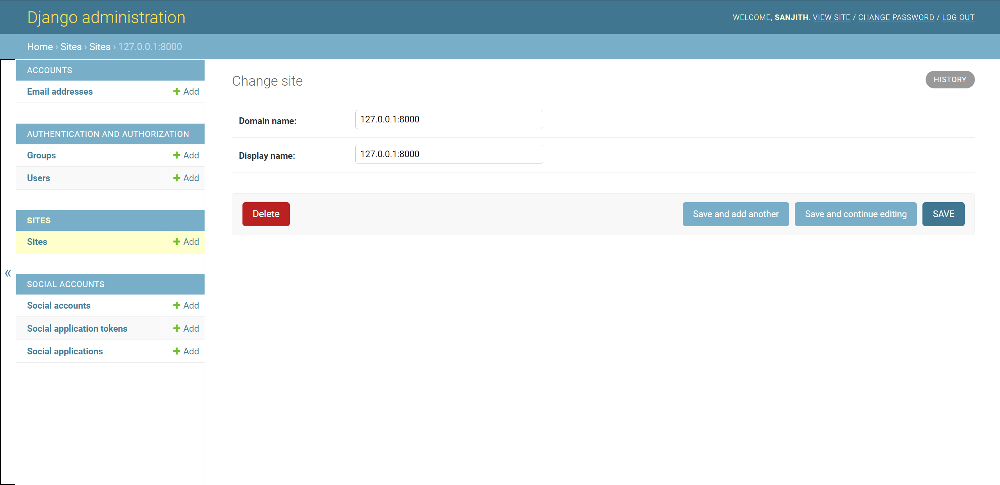
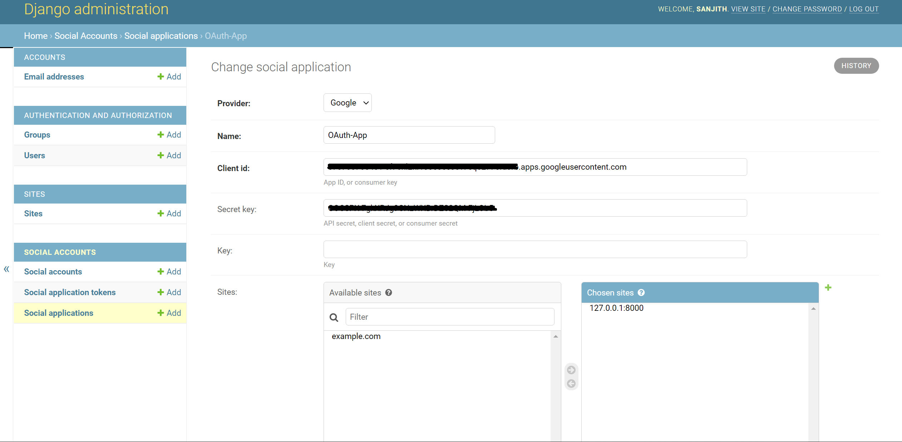

# Django OAuth 2.0 Google Authentication

This is a sample project to explore social (Google) OAuth 2.0 authentication integration with Django using [`django-allauth`](https://django-allauth.readthedocs.io/en/latest/index.html).

### Add social app in Django admin

First, **create a superuser** by running the following command in a terminal:

```Shell
$ python3 manage.py createsuperuser
```

Fill in all the necessary details (username, email, password).

Run the app using:

```Shell
$ python3 manage.py runserver
```

Open http://127.0.0.1:8000/admin or http://localhost:8000/admin and login to Django Admin. Under Sites, **click Add** and **put either 127.0.0.1:8000 or localhost:8000** as both the **Domain name** and **Display name**.

NOTE: It is possible that **Django created an 'example.com' site for you already** (if it's not a new project). You can also amend the existing site created instead of creating a new one.



Then, under **Social Applications**, **click Add** and fill in the details as follows:

- Provider: Google
- Name: `<APP_NAME>`
- Client id: `<CLIENT_ID>` (from Step 3)
- Secret key: `<SECRET_KEY>` (from Step 3)
- Sites: **Select your Site** in 'Available sites' and **click the arrow** to move it into 'Chosen sites'



Since you are currently logged in as a superuser, **logout and login again using your Google account** to test out the authentication.

**NOTE:**

If you get an error: `SocialApp matching query does not exist` at http://127.0.0.1:8000/accounts/google/login/, it means that the **ID of the site you created in Django admin** is **not the same** as the one in `settings.py`.

It is possible that **Django created an 'example.com' site for you already** (if it's not a new project). So if this is the case you will need to delete that entry from the Sites admin page **AND** change the `SITE_ID` in `settings.py` to be the correct ID (probably 2 rather than 1).

Consider playing around with the `SITE_ID` value. For example: `SITE_ID = 3`, etc.

<br>
## References

1. https://github.com/pennersr/django-allauth
2. https://django-allauth.readthedocs.io/en/latest/index.html
3. https://django-allauth.readthedocs.io/en/latest/installation.html
4. https://django-allauth.readthedocs.io/en/latest/providers.html
5. https://developers.google.com/gmail/api/quickstart/js
6. https://www.youtube.com/watch?v=NG48CLLsb1A
7. https://www.section.io/engineering-education/django-google-oauth/
8. https://whizzoe.medium.com/in-5-mins-set-up-google-login-to-sign-up-users-on-django-e71d5c38f5d5
9. https://stackoverflow.com/questions/8477530/how-to-access-user-names-and-profiles-with-django-allauth
10. https://github.com/pennersr/django-allauth/blob/master/allauth/socialaccount/models.py#L89
